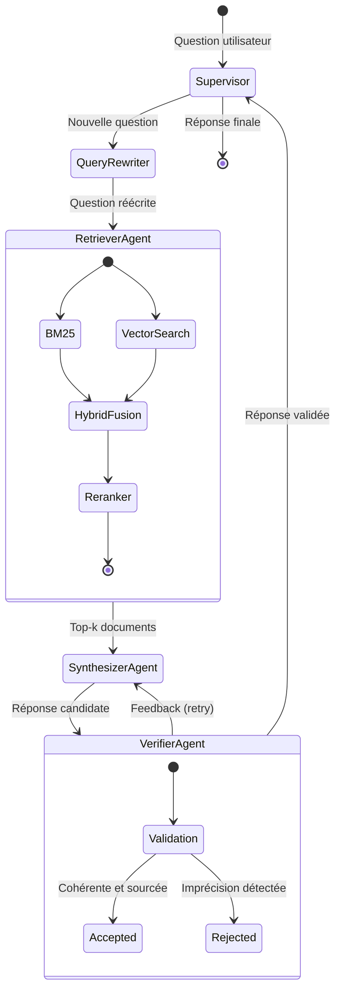
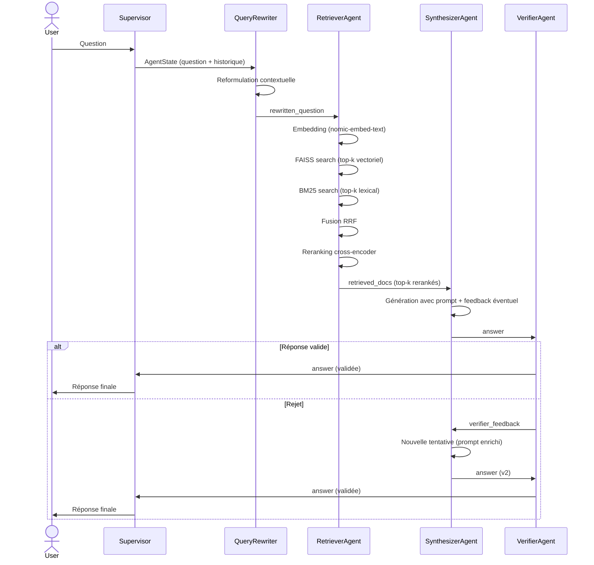

# ARCHITECTURE.md — my-rag-system

Ce document décrit la vision technique du projet : organisation du code, flux de données, choix de conception, estimations de performance et pistes d'amélioration.

---

## Table des matières

- [Vision globale](#vision-globale)
- [Organisation des dossiers et fichiers](#organisation-des-dossiers-et-fichiers)
- [Diagramme des agents](#diagramme-des-agents)
- [Flux de données détaillé](#flux-de-données-détaillé)
- [Tableau des choix techniques](#tableau-des-choix-techniques)
- [Estimations des coûts](#estimations-des-coûts)
- [Estimations de latence](#estimations-de-latence)
- [Limites actuelles](#limites-actuelles)
- [Améliorations futures](#améliorations-futures)

---

## Vision globale

Le système est un **RAG (Retrieval-Augmented Generation) multi-agents** entièrement local. Il permet d'interroger une base documentaire en langage naturel et de recevoir des réponses sourcées, vérifiées, et contextuellement cohérentes avec l'historique de la conversation.

Le projet repose sur trois principes de conception :

**Localité** — aucun appel à une API externe. Les modèles d'embedding et de génération tournent via Ollama sur la machine de l'utilisateur.

**Séparation des responsabilités** — chaque agent a un rôle unique et clairement délimité. Le superviseur LangGraph est la seule entité qui connaît l'état global et décide des transitions.

**Qualité de récupération** — la recherche hybride (BM25 + vectorielle) combinée au reranking maximise la pertinence des documents transmis au LLM, limitant les hallucinations et améliorant la fidélité des réponses.

---

## Organisation des dossiers et fichiers

```
my-rag-system/
|
├── ARCHITECTURE.md
├── README.md
├── data
│   ├── GameEngineCourse.pdf
│   ├── Game_Programming_Algorithms_and_Techniques.md
│   └── Game_Programming_Patterns.txt
├── requirements.txt
├── scripts
│   └── ingest.py
├── src
│   ├── __init__.py
│   ├── agents
│   │   ├── __init__.py
│   │   ├── retriever_agent.py
│   │   ├── state.py
│   │   ├── supervisor.py
│   │   ├── synthesizer_agent.py
│   │   └── verifier_agent.py
│   ├── config.py
│   ├── exceptions.py
│   ├── ingestion
│   │   ├── __init__.py
│   │   ├── chunker.py
│   │   ├── document_loader.py
│   │   └── loaders.py
│   ├── main.py
│   ├── memory
│   │   ├── __init__.py
│   │   ├── conversation.py
│   │   └── query_rewriter.py
│   ├── rag
│   │   ├── generator.py
│   │   └── prompt.py
│   ├── retrieval
│   │   ├── bm25.py
│   │   ├── embeddings.py
│   │   ├── hybrid.py
│   │   ├── reranker.py
│   │   └── vector_store.py
│   └── utils
│       ├── __init__.py
│       └── logger.py
├── structure.txt
└──── tests
    ├── demo.py
    └── retrieval.py
```

### Responsabilités des modules clefs

**`scripts/ingest.py`** — point d'entrée unique de la phase d'ingestion. Charge les fichiers du dossier `data/`, délègue le découpage à `chunker.py`, génère les embeddings via `embeddings.py`, puis sérialise l'index FAISS dans `vector_store/`. À relancer uniquement lorsque le corpus change.

**`src/agents/state.py`** — définit le `TypedDict` central (`AgentState`) contenant : la question originale, la question réécrite, les documents récupérés, la réponse courante, le feedback du vérificateur, et l'historique de conversation. C'est le contrat partagé entre tous les nœuds du graphe.

**`src/agents/supervisor.py`** — compile le graphe LangGraph, définit les arêtes conditionnelles (notamment la boucle verifier → synthesizer), et gère l'exécution pas à pas.

---

## Diagramme des agents



### Schéma d'état partagé (`AgentState`)

| Champ | Type | Rôle |
|---|---|---|
| `question` | `str` | Question brute de l'utilisateur |
| `reformulated` | `str` | Question reformulée par le QueryRewriter |
| `retrieved_docs` | `list[Document]` | Documents récupérés et rerankés |
| `answer` | `str` | Réponse courante produite par le Synthesizer |
| `is_verified` | `bool` | Verifier a accepter la réponse ou non |
| `verification_feedback` | `str` | Feedback du Verifier en cas de rejet |
| `retry_count` | `int` | Nombre de tentatives de synthèse (protection contre les boucles infinies) |

---

## Flux de données détaillé



---

## Tableau des choix techniques

| Composant | Technologie retenue | Alternatives considérées | Raison du choix |
|---|---|---|---|
| **Framework agents** | LangChain + LangGraph | LlamaIndex, AutoGen, CrewAI | LangGraph offre un contrôle explicite du graphe d'état et des arêtes conditionnelles ; LangChain fournit les abstractions documentaires |
| **LLM** | llama3.2:3b via Ollama | Mistral 7B, Phi-3, GPT-4o | Modèle léger, rapide sur CPU/GPU modeste, suffisant pour la synthèse sur documents courts ; 100 % local |
| **Embeddings** | nomic-embed-text via Ollama | all-MiniLM-L6, text-embedding-3-small | Bon équilibre performance/dimension (768d) ; open-source et local |
| **Vector store** | FAISS | Chroma, Qdrant, Weaviate | Pas de serveur à maintenir ; sérialisation fichier simple ; performant pour des corpus < 100k chunks |
| **Recherche lexicale** | BM25 (rank_bm25) | TF-IDF, Elasticsearch | Implémentation pure Python, sans infrastructure ; efficace pour les correspondances exactes et les termes rares |
| **Fusion hybride** | Reciprocal Rank Fusion (RRF) | Score moyen pondéré, CombSUM | Agnostique aux échelles de score ; robuste et simple à implémenter |
| **Reranking** | Cross-encoder (sentence-transformers) | Cohere Rerank, ColBERT | Local et gratuit ; améliore significativement la précision du top-k final |
| **Chunking** | RecursiveCharacterTextSplitter | MarkdownTextSplitter, SentenceSplitter | Respecte les séparateurs naturels (paragraphes, phrases) ; universel pour PDF/TXT/MD |
| **Orchestration** | LangGraph (StateGraph) | Chaînes séquentielles LangChain | Permet les boucles conditionnelles (retry verifier) et l'état typé partagé entre agents |

---

## Estimations des coûts

Le projet fonctionne **entièrement en local** via Ollama. Il n'y a aucun coût d'API. Les seuls coûts associés sont énergétiques (électricité) et matériels (amortissement du hardware).

---

### Facteurs d'influence des latences

**Taille du corpus** — l'index FAISS et le BM25 sont quasi instantanés jusqu'à ~50k chunks. Au-delà, la recherche vectorielle exacte peut devenir un goulot d'étranglement (envisager HNSW).

**Longueur du contexte** — plus les chunks récupérés sont longs, plus la génération LLM est lente. La taille de chunk actuelle (récursif, ~512 tokens) est un bon compromis.

**Hardware** — llama3.2:3b en quantisation Q4 tourne correctement sur 8 Go de RAM. Avec un GPU dédié et CUDA, la latence de génération descend à ~1–2 s par appel.

---

## Limites actuelles

**Latence** — mon PC n'a pas de GPU ce qui rend le tout très lent — en atteste les 907.68s de temps de génération pour ~591 tokens pour la démo — cela m'a donc fait perdre beaucoup de temps de test, plus que nécessaire et m'empêche de faire une estimation probable.

**Corpus statique** — le vector store doit être régénéré manuellement à chaque modification du corpus (`scripts/ingest.py`). Il n'y a pas de mise à jour incrémentale.

**Pas de persistance de la mémoire** — l'historique de conversation est en mémoire vive. Il est perdu à chaque redémarrage du processus (`src/main.py`).

**Reranker non fine-tuné** — le cross-encoder utilisé est un modèle généraliste. Il n'a pas été adapté au domaine des documents ingérés, ce qui peut affecter la précision du reranking sur des termes très techniques.

**Boucle verifier bornée implicitement** — la protection contre les boucles infinies (champ `retry_count`) doit être configurée explicitement. En l'absence de limite stricte, un verifier trop exigeant peut bloquer le pipeline.

**Mono-utilisateur** — `src/main.py` gère une seule session à la fois. Le système n'est pas conçu pour une utilisation concurrente.

**Formats supportés limités** — seuls les fichiers `.pdf`, `.txt` et `.md` sont pris en charge par les loaders actuels. Les formats `.docx`, `.html` ou `.csv` nécessiteraient des loaders additionnels.

---

## Améliorations futures

### Court terme

**Persistance de la mémoire conversationnelle** — sérialiser l'historique dans un fichier JSON ou une base de donnée (SQLite par exemple) pour maintenir le contexte entre les sessions.

**Ingestion incrémentale** — détecter les documents nouveaux ou modifiés dans `data/` et mettre à jour uniquement les chunks concernés dans le vector store, sans regénérer l'index complet.

**Interface CLI améliorée** — ajouter des flags (`--verbose`, `--top-k`, `--no-rerank`) pour contrôler le comportement du pipeline sans modifier le code.

### Moyen terme

**Support de formats additionnels** — ajouter des loaders pour `.docx`, `.html`, `.csv` et les URLs web dans `src/ingestion/loaders.py`.

**Reranker adapté au domaine** — fine-tuner le cross-encoder sur des paires (question, chunk pertinent) issues du corpus cible pour améliorer la précision du reranking.

**Index HNSW** — migrer de la recherche exacte FAISS vers un index HNSW (Hierarchical Navigable Small World) pour maintenir des temps de recherche constants sur des corpus > 100k chunks.

**Évaluation automatisée (RAG eval)** — intégrer un framework d'évaluation (RAGAS ou TruLens) pour mesurer objectivement la fidélité des réponses, le rappel des documents et la précision de la récupération sur un jeu de questions annotées.

### Long terme

**Interface web** — exposer le système via une API REST (FastAPI) et une interface conversationnelle légère (Streamlit ou Gradio) pour faciliter les démonstrations.

**Multi-utilisateur et sessions isolées** — gérer plusieurs sessions concurrentes avec des historiques de conversation distincts.

**Passage à un modèle plus performant** — remplacer llama3.2:3b par llama3:8b ou Mistral 7B Instruct lorsque les ressources hardware le permettent, pour améliorer la qualité de synthèse sur des questions complexes.

**Observabilité** — intégrer LangSmith ou un équivalent open-source (Langfuse) pour tracer les appels LLM, mesurer les latences par nœud et identifier les régressions de qualité au fil du temps.