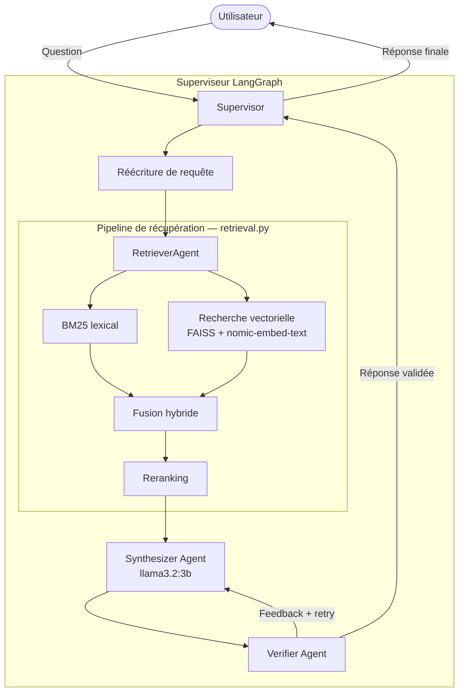

# my-rag-system

Système de **Retrieval-Augmented Generation (RAG)** multi-agents conçu pour répondre à des questions à partir d'une base documentaire locale. Le projet repose entièrement sur des modèles open-source exécutés via **Ollama** — aucune clé API externe n'est requise.

L'orchestration est assurée par un superviseur **LangGraph** qui coordonne trois agents spécialisés : récupération, synthèse et vérification.

---

## Table des matières

- [Prérequis](#prérequis)
- [Installation](#installation)
- [Configuration](#configuration)
- [Quickstart](#quickstart)
- [Architecture](#architecture)
- [Exemples](#exemples)
- [Structure du projet](#structure-du-projet)
- [Conclusion](#conclusion)

---

## Prérequis

- Python 3.10+
- [Ollama](https://ollama.com) installé et en cours d'exécution
- Les modèles suivants disponibles localement :

```bash
# Install Ollama Linux / macOS :
curl -fsSL https://ollama.com/install.sh | sh

# Install Ollama Windows :
irm https://ollama.com/install.ps1 | iex

# Install the models
ollama pull llama3.2:3b
ollama pull nomic-embed-text
```

---

## Installation

```bash
# 1. Cloner le dépôt
git clone https://github.com/AgendaSociable/my-rag-system.git
cd my-rag-system

# 2. Créer et activer l'environnement virtuel
python3 -m venv venv
source venv/bin/activate        # Linux / macOS
# venv\Scripts\activate         # Windows

# 3. Installer les dépendances
pip install -r requirements.txt
```

---

## Configuration

Créer un fichier `.env` à la racine du projet :

```env
LLM_MODEL=llama3.2:3b
EMBEDDING_MODEL=nomic-embed-text
OLLAMA_BASE_URL=http://localhost:11434
```

> Assurez-vous qu'Ollama tourne en arrière-plan avant de lancer le système (`ollama serve`).

>/!\ Je vous montre ici le contenu de .env car il n'y a rien de confidentiel dans mon cas. Évidemment dans un contexte réel le contenu du .env ne doit apparaître nulle part. 

---

## Quickstart

### 1. Ingestion des documents

Placez vos documents dans le dossier `data/` (formats supportés : `.pdf`, `.txt`, `.md`), puis lancez l'ingestion :

```bash
python -m scripts.ingest
```

> Cette étape génère le dossier `vector_store/` contenant l'index FAISS (`index.faiss`) et les métadonnées associées (`index.pkl`).

### 2.1 Interroger le système

```bash
python -m src.main
```

Le superviseur orchestre automatiquement le pipeline complet : réécriture de la requête → récupération hybride → synthèse → vérification → réponse finale.

### 2.2 Utiliser le script de démo

```bash
python -m tests.demo
```
Le script de démo va permettre de lancer des questions pré-faite par rapport au contexte de base - la programmation de jeux vidéo - et de visualiser le fonctionnement grâce au demo_results.md qui sera créer à la fin de l'execution du script

---

## Architecture

Le pipeline RAG suit un flux en plusieurs étapes orchestré par un superviseur LangGraph.



### Agents

| Agent | Rôle |
|---|---|
| **Supervisor** | Orchestre le flux entre les agents via LangGraph ; gère les transitions d'état |
| **RetrieverAgent** | Exécute la récupération hybride (BM25 + vectorielle) et le reranking |
| **SynthesizerAgent** | Génère une réponse en citant les documents récupérés ; intègre le feedback du vérificateur en cas de rejet |
| **VerifierAgent** | Valide la cohérence et la fidélité de la réponse par rapport aux sources ; renvoie un feedback si nécessaire |

---

## Exemples

Les exemples ci-dessous supposent que les documents présents dans `data/` portent sur la programmation de jeux vidéo.

**Exemple 1 — Question directe**
```
> Quels sont les principaux design patterns utilisés en game programming ?

→ Le system identifie les documents pertinents et génère une réponse
  structurée en citant les sources récupérées.
```

**Exemple 2 — Question nécessitant une vérification**
```
> Quelle est la différence entre un game loop fixe et un game loop variable ?

→ Le SynthesizerAgent produit une première réponse.
  Le VerifierAgent détecte une imprécision et renvoie un feedback.
  Le SynthesizerAgent génère une réponse corrigée, validée ensuite.
```

**Exemple 3 — Requête ambiguë (réécriture)**
```
> C'est quoi l'ECS ?

→ Le QueryRewriter reformule la question en tenant compte du contexte
  conversationnel avant de lancer la récupération.
```

---

## Structure du projet

```
my-rag-system/
|
├── ARCHITECTURE.md
├── README.md
├── data
│   ├── GameEngineCourse.pdf
│   ├── Game_Programming_Algorithms_and_Techniques.md
│   └── Game_Programming_Patterns.txt
├── requirements.txt
├── scripts
│   └── ingest.py
├── src
│   ├── __init__.py
│   ├── agents
│   │   ├── __init__.py
│   │   ├── retriever_agent.py
│   │   ├── state.py
│   │   ├── supervisor.py
│   │   ├── synthesizer_agent.py
│   │   └── verifier_agent.py
│   ├── config.py
│   ├── exceptions.py
│   ├── ingestion
│   │   ├── __init__.py
│   │   ├── chunker.py
│   │   ├── document_loader.py
│   │   └── loaders.py
│   ├── main.py
│   ├── memory
│   │   ├── __init__.py
│   │   ├── conversation.py
│   │   └── query_rewriter.py
│   ├── rag
│   │   ├── generator.py
│   │   └── prompt.py
│   ├── retrieval
│   │   ├── bm25.py
│   │   ├── embeddings.py
│   │   ├── hybrid.py
│   │   ├── reranker.py
│   │   └── vector_store.py
│   └── utils
│       ├── __init__.py
│       └── logger.py
├── structure.txt
└──── tests
    ├── demo.py
    └── retrieval.py
```

---

## Conclusion

Ce projet implémente un pipeline RAG multi-agents local, sans dépendance à un service cloud. Les points clés :

- **Récupération hybride** — combinaison de BM25 et de la recherche vectorielle pour maximiser le rappel et la précision
- **Boucle de vérification** — le VerifierAgent agit comme garde-fou avant de retourner une réponse à l'utilisateur
- **100 % local** — tous les modèles tournent via Ollama ; aucune donnée ne quitte la machine
- **Extensible** — l'architecture en agents permet d'ajouter facilement de nouvelles capacités (nouveau agent, nouveau loader, autre LLM)

---

### Retour personnel

Je tiens à remercier sincèrement l'équipe Stackeasy pour cette opportunité. Ce test technique a été une vraie expérience d'apprentissage : je suis parti de zéro sur le sujet RAG qui m'était alors complètement inconnu techniquement parlant et j'ai construit ce système pas à pas. Tout n'est pas parfait évidemment, mais j'ai fait de mon mieux avec les ressources et le temps disponibles.

**Sur le choix d'Ollama** — ce n'est pas la solution la plus performante comparée aux APIs OpenAI ou Anthropic, mais elle est gratuite, locale et entièrement open source. C'est un choix délibéré : je considère qu'il est préférable, quand c'est possible, de ne pas dépendre de services centralisés et propriétaires. Dans un cadre professionnel avec une stack imposée, je m'adapterai sans hésiter — mais ma démarche naturelle ira toujours vers l'open source, et vers des solutions françaises ou européennes quand elles existent.

**Sur l'accessibilité** — j'avais prévu une image Docker pour simplifier le déploiement et garantir la reproductibilité de l'environnement, mais je n'ai malheureusement pas eu le temps de la finaliser. C'est clairement un point à compléter.

**Sur l'optimisation** — il y a probablement des aspects que j'aurais pu mieux construire, notamment dans la façon dont les modèles Ollama sont sollicités (batching, gestion du contexte, choix des paramètres). J'ai fait avec les ressources matérielles à ma disposition, et ces points d'amélioration sont identifiés dans [`ARCHITECTURE.md`](./ARCHITECTURE.md).
